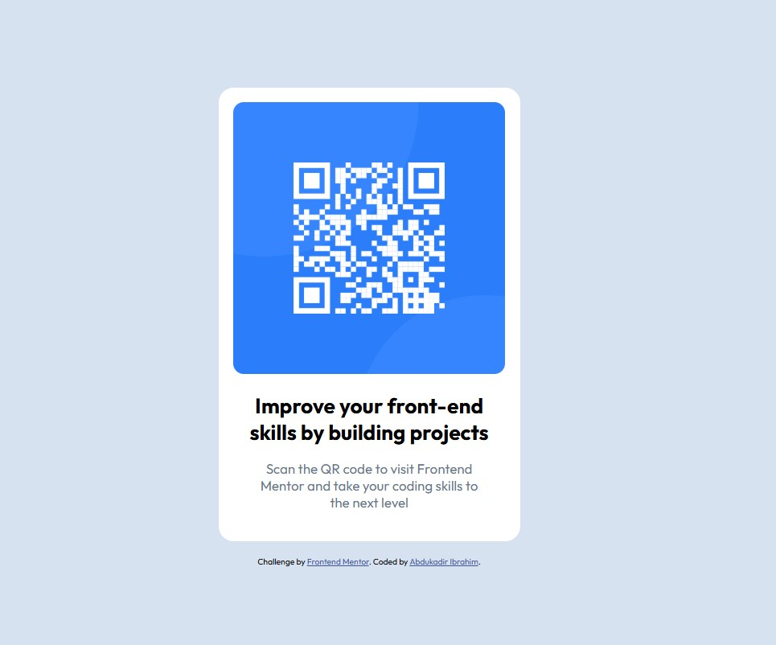

# Frontend Mentor - QR Code Component Solution

This is a solution to the [QR Code Component challenge on Frontend Mentor](https://www.frontendmentor.io/challenges/qr-code-component-iux_sIO_H).  
Frontend Mentor challenges help you improve your HTML & CSS skills by building realistic projects.

---

## 📋 Table of Contents

- [Overview](#overview)
  - [Screenshot](#screenshot)
  - [Links](#links)
- [My Process](#my-process)
  - [Built With](#built-with)
  - [What I Learned](#what-i-learned)
  - [Useful Resources](#useful-resources)
- [Author](#author)
- [Acknowledgments](#acknowledgments)

---

## 🧾 Overview

### 📸 Screenshot



### 🔗 Links

- 💡 Solution URL: [https://github.com/icabduqaadir12/qr-code-component](https://github.com/icabduqaadir12/qr-code-component)
- 🚀 Live Site URL: [https://icabduqaadir12.github.io/qr-code-component/](https://icabduqaadir12.github.io/qr-code-component/)

---

## ⚙️ My Process

### 🛠 Built With

- Semantic HTML5 markup
- CSS3 custom properties
- Flexbox
- Mobile-first workflow
- [GitHub Pages](https://pages.github.com/) for deployment

### ✅ What I Learned

While working on this project, I practiced:

- Centering a card using Flexbox
- Styling cards with padding, margin, and border-radius
- Writing clean and semantic HTML
- Improving visual hierarchy with font sizes and spacing

```html
<div class="qr-card">
  
  <h1>Improve your front-end skills by building projects</h1>
  <p>Scan the QR code to visit Frontend Mentor and take your coding skills to the next level</p>
</div>
```

### 📚 Useful Resources

- [Flexbox Guide – CSS Tricks](https://css-tricks.com/snippets/css/a-guide-to-flexbox/)
- [Frontend Mentor Community](https://www.frontendmentor.io/community)

---

## 👨‍💻 Author

- Frontend Mentor: [@icabduqaadir12](https://www.frontendmentor.io/profile/icabduqaadir12)
- GitHub: [@icabduqaadir12](https://github.com/icabduqaadir12)

---

## 🙏 Acknowledgments

Thanks to [Frontend Mentor](https://www.frontendmentor.io) for providing this simple yet useful beginner challenge.  
Shoutout to the dev community for helping others grow and improve through real-world projects.

---

**Happy coding! 🚀**
